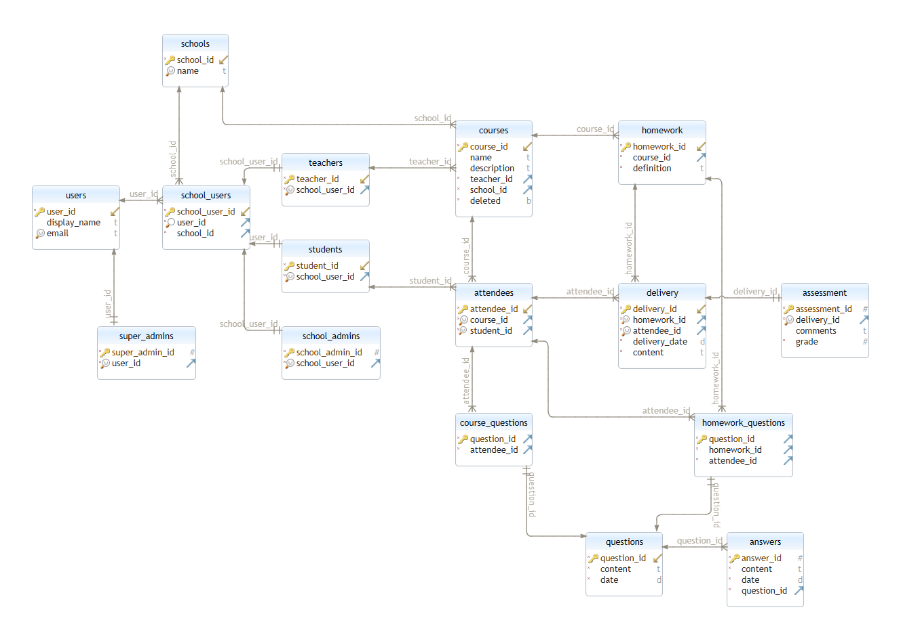
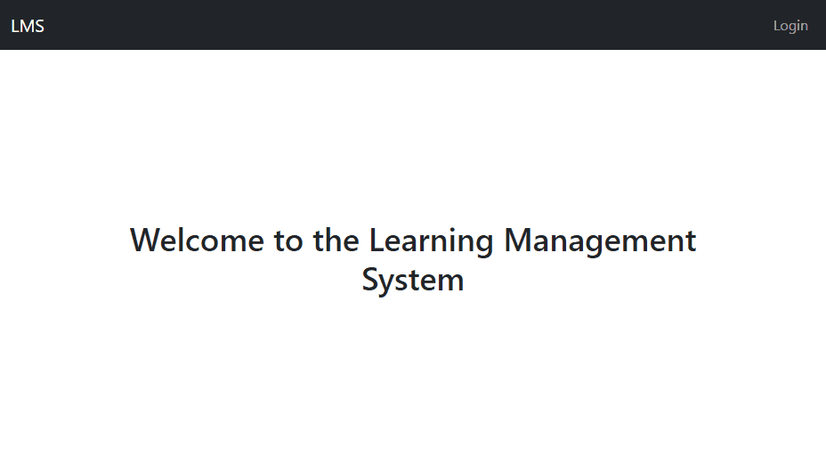

# LMS - Implementation (work in progress)

This is an exercise done to improve my technical skills on ERD and API design and implementation.

The application architecture has the following layers:

## Client

React application with Bootstrap styles.

## Backend

NodeJS + Express + TypeORM.

## Database

Postgres

# Status

## Done
- Users allowed to login with Google credentials.
- Users allowed to login with user/pass.
- Different profiles able to access read-only data based on their profile.

## TODO
- Authorization based on user profile.
- Implement pending entities from the ERD.
- Unit testing.
- CRUD features.

## Demo

